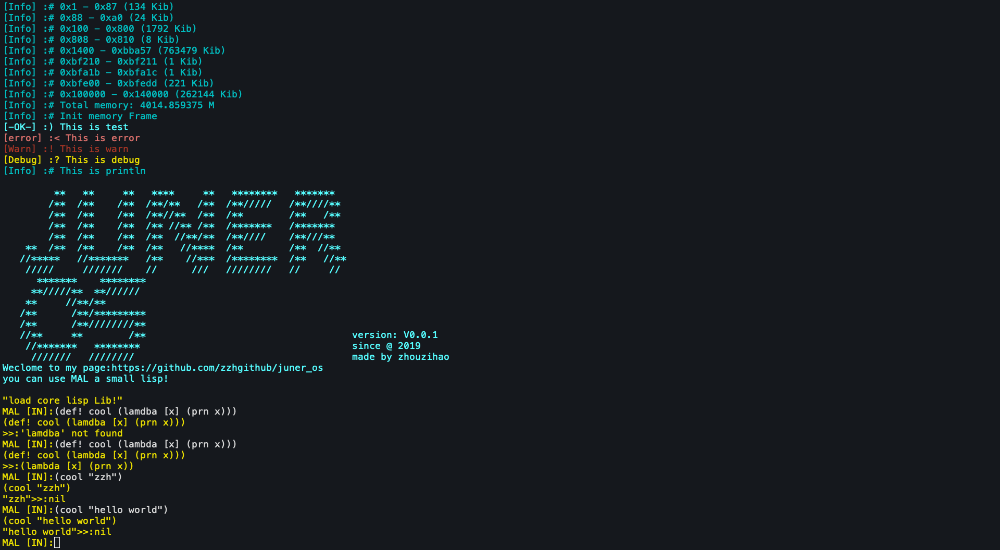

# juner_os



[中文](./README_CN_ZH.md)

# introduction
This project combines elements from both [blog_os](https://os.phil-opp.com/) and [mal](https://github.com/kanaka/mal).  
A lisp shell that can run interactive is now implemented. The subsequent goal is to organize the code of the operating system in a mixed way of lisp and rust. At the same time, the core library is ready to be loaded and maintained using lisp. The project is in progress.

# features
- rust implementation of the kernel (load BIOS)
- LISP REPL

# dependencies
- rustc 1.48.0-nightly
- qemu


# run
```
make all
```

# Lisp mal grammar
- [Grammar](./grammar.md)


# Dream List

- [ ] display printing in VGA text mode
  - [x] Cursor Follow
  - [x] Delete
  - [ ] Code Tip Tab
  - [ ] Cursor mobile editing
  - [ ] Scroll bar
- [ ] Lisp Full Functionality
  - [x] Macro support
  - [ ] Support for code hints
  - [ ] sacnf method
  - [ ] File Read/Write
  - [ ] module loading
  - [ ] JIT
  - [ ] support for call/cc
- [ ] Equipment
  - [ ] Identify the hard drive
  - [ ] Sound Drive
  - [ ] Network Card Support
- [ ] abstract function
  - [x] UEFI support
  - [ ] Parallel Multitasking
  - [ ] GUI support
  - [ ] network load lisp module
  - [ ] Multiple Core Utilization
  - [ ] bootstrapping (supporting rust environments)
- [ ] the dream app
  - [ ] MAL, the editor of the dialect.
  - [ ] NoteBook

# Work and goals now

At present the realization of the function is still very preliminary, lisp inside there is no mechanism to achieve, the kernel has to realize the content. Now we are working on using UEFI to boot, so that the system can read and write files, and run them within lisp.
Later the uefi branch will be merged into the master branch and used as a mainstream.

# Looking forward to you joining and improving the project

Contact me: zzhggmm@gmail.com