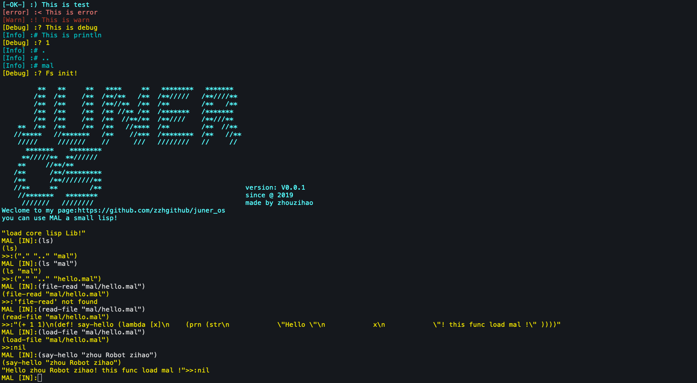

# juner_os



[中文](./Readme_zh_CN.md)

# introduction

This project combines elements from both [blog_os](https://os.phil-opp.com/) and [mal](https://github.com/kanaka/mal).  
A lisp shell that can run interactive is now implemented. The subsequent goal is to organize the code of the operating system in a mixed way of lisp and rust. At the same time, the core library is ready to be loaded and maintained using lisp. The project is in progress.

# features

- rust implementation of the kernel (load BIOS)
- LISP REPL
- Support for load-file method to load mal files after kernel load.
- The code can now be written in the user folder. It can be loaded using the laod-file method in the replica after kernel boot.
- The kernel loads `entry.jaml` as an entry file.
- The extension of the lisp dialect is `jmal` (Juner-os's Make A Lisp!).
- Supports ps2 mouse. Just open the comments in kernel/src/board/mouse.rs.

# dependencies

- rustc 1.48.0-nightly
- qemu

# run

```
make all
```

# Lisp mal grammar

- [Grammar](./grammar.md)

# Dream List

- [ ] display printing in VGA text mode
  - [x] Cursor Follow
  - [x] Delete
  - [ ] Code Tip Tab
  - [x] Cursor mobile editing
  - [ ] Scroll bar
- [ ] Lisp Full Functionality
  - [x] Macro support
  - [ ] Support for code hints
  - [ ] sacnf method
  - [ ] File Read/Write
  - [ ] module loading
  - [ ] JIT
  - [ ] support for call/cc
- [ ] Equipment
  - [ ] Identify the hard drive
  - [ ] Sound Drive
  - [ ] Network Card Support
- [ ] abstract function
  - [x] UEFI support
  - [ ] Parallel Multitasking
  - [ ] GUI support
  - [ ] network load lisp module
  - [ ] Multiple Core Utilization
  - [ ] bootstrapping (supporting rust environments)
- [ ] the dream app
  - [ ] MAL, the editor of the dialect.
  - [ ] NoteBook
  - [ ] mal's vscode editor plugin

# Work and goals now

~~At present the realization of the function is still very preliminary, lisp inside there is no mechanism to achieve, the kernel has to realize the content. Now we are working on using UEFI to boot, so that the system can read and write files, and run them within lisp.Later the uefi branch will be merged into the master branch and used as a mainstream.~~

The load-file has been largely implemented. Now there are two directions to go.~~ One is to write a mal language plugin for vscode (developed as a separate project, of course).~~ The other is to write a simple editor to implement a freeze-like method. Let the methods currently running in the kernel be written to a disk file and then saved out in reverse by a script.

# Looking forward to you joining and improving the project

Contact me: zzhggmm@gmail.com

# Thanks

- blog_os
- mal
- rcore
- @senseiod and wich project I copy a lot: https://github.com/senseiod/AiliceOS
