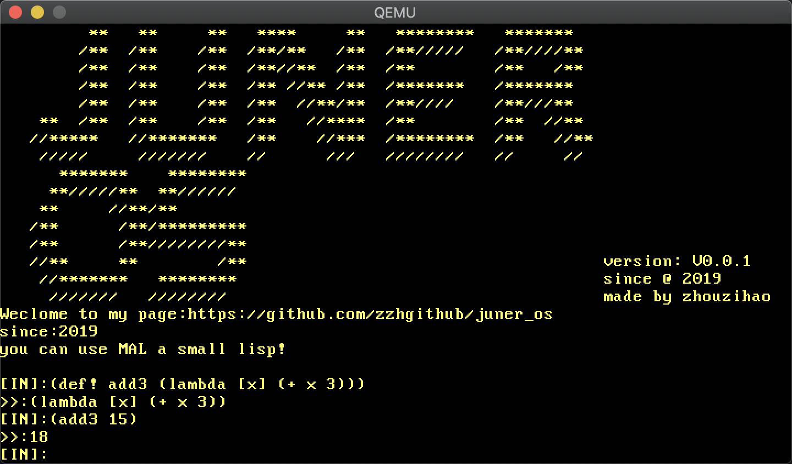

# juner_os




联系我: zzhggmm@gmail.com
# introduction
A lisp shell that can run interactive is now implemented. The subsequent goal is to organize the code of the operating system in a mixed way of lisp and rust. At the same time, the core library is ready to be loaded and maintained using lisp. The project is in progress.

# 简介
这个项目结合了blog_os和mal两个项目的内容。现在实现了一个可以运行交互的lisp shell.后续目标是使用lisp和rust混合的方式组织操作系统的代码。并而核心库准备使用lisp进行加载和维护。项目进行中。


# 功能计划(没有实现的)
- [ ] VGA text mode 下显示打印
  - [x] 光标跟随
  - [x] 删除
  - [ ] 代码提示Tab
  - [ ] 光标移动编辑
  - [ ] 滚动条
- [ ] Lisp 完整功能
  - [x] 支持宏
  - [ ] 支持代码提示
  - [ ] sacnf方法
  - [ ] 文件读写
  - [ ] 模块加载
  - [ ] JIT
  - [ ] 支持call/cc
- [ ] 设备
  - [ ] 识别硬盘
  - [ ] 声音驱动
  - [ ] 网卡支持
- [ ] 抽象的功能
  - [ ] 并行多任务
  - [ ] 支持GUI
  - [ ] 网络加载lisp模块
  - [ ] 多核心利用
  - [ ] 自举（支持rust环境）
- [ ] 梦中的app
  - [ ] MAL 这个方言的编辑器
  - [ ] NoteBook

## 开发日志

- [开发日志详细文档](https://www.yuque.com/xiaohao-i0lwb/fn1hxc)

## 直接测试运行

```
cargo xrun
```

##  使用rust-gdb 进行断点执行

```
./gdb.sh
./touchme.sh

```
### 断点指令
- b  打断点
- n  执行下一行( 这个方法比较哈！ 只能执行当前文件的一行)
- tui enable 打开源代码视图
- print 打印变量值
- c 继续执行到下一个断点
- s 运行到下一步（但是没有进入到内联汇编的汇编中 比较遗憾）


## todo
- 正常输入输出
- 多线程支持
- lisp REPL基础实现
    - 实现hashmap和关键字类型
    - 实现gemsym方法
    - 实现call/cc方法
- 在操作系统层面实现文件系统，并且允许lisp进行加载(最好在修改以后可以永久的进行改变) 或者直接加载网络上

## Lisp 的语法:
- [语法](./grammar.md)

### BNF
> 在双引号中的字(“word”)代表着这些字符本身。而double_quote用来代表双引号。  
> 在双引号外的字（有可能有下划线）代表着语法部分。  
> 尖括号( < > )内包含的为必选项。  
> 方括号( [ ] )内包含的为可选项。  
> 大括号( { } )内包含的为可重复0至无数次的项。  
> 竖线( | )表示在其左右两边任选一项，相当于”OR”的意思。  
> ::= 是“被定义为”的意思。

基本s表达式生成语法

```bnf
s_expression ::= atomic_symbol |
               | "(" s_expression "."s_expression ")" |
               | list 
   
list ::= "(" s_expression < s_expression > ")"

atomic_symbol ::= letter atom_part

atom_part ::= empty | letter atom_part | number atom_part

letter ::= "a" | "b" | " ..." | "z"

number ::= "1" | "2" | " ..." | "9"

empty ::= " "
```

TODO!!问题上面的定义不能很好的识别出字符串作为元素!!!


## rust 镶嵌lisp
## lisp与rust交互数据

## 核心库？

## 是否可以用lisp中的进程管理和多线程实现一个打scanf方法
疑问？需要使用syscall和信号量等概念吗？

# 参考资料
- (Lisp Bnf)[https://iamwilhelm.github.io/bnf-examples/lisp]
- (Json 识别状态机 【参考用】)[https://www.json.org/json-en.html]