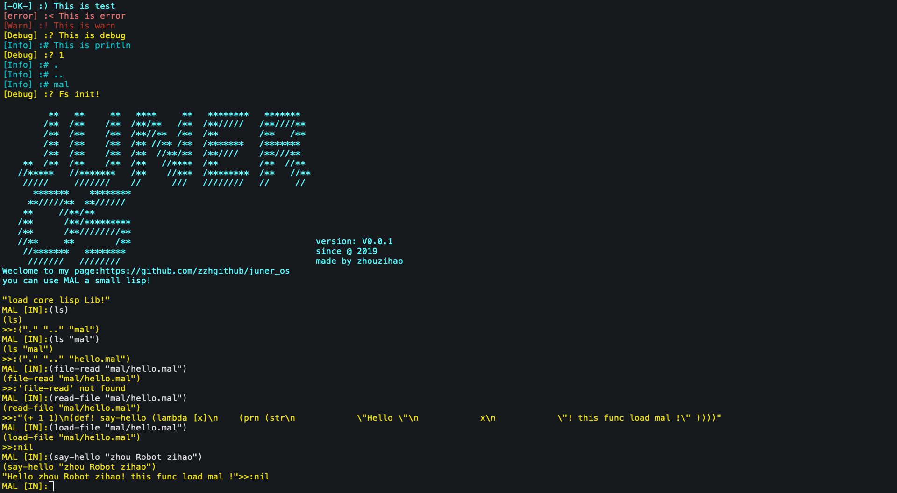

# juner_os



[English](.README.md)

# 简介

这个项目结合了[blog_os](https://os.phil-opp.com/)和[mal](https://github.com/kanaka/mal)两个项目的内容。  
现在实现了一个可以运行交互的 lisp shell.后续目标是使用 lisp 和 rust 混合的方式组织操作系统的代码。并而核心库准备使用 lisp 进行加载和维护。项目进行中。

# 特性

- rust 实现的内核
- LISP REPL
- 支持了 load-file 方法，可以在内核加载后加载 mal 文件
- 现在代码可以写在 user 文件夹下。在内核启动后的 repl 中可以使用 laod-file 方法进行加载。
- 内核加载后会加载`entry.jaml`作为入口文件
- lisp 方言的扩展名为`jmal`(Juner-os's Make A Lisp!)

# 依赖

- rustc 1.48.0-nightly
- qemu

# 运行

```
make all
```

# Lisp 的语法:

- [语法](./grammar_zh.md)

# 梦想清单

- [ ] VGA text mode 下显示打印
  - [x] 光标跟随
  - [x] 删除
  - [ ] 代码提示 Tab
  - [x] 光标移动编辑
  - [ ] 滚动条
- [ ] Lisp 完整功能
  - [x] 支持宏
  - [ ] 支持代码提示
  - [ ] sacnf 方法
  - [ ] 文件读写
  - [ ] 模块加载
  - [ ] JIT
  - [ ] 支持 call/cc
- [ ] 设备
  - [x] 识别硬盘 (ahci 使用 rcore-fuse)
  - [ ] 声音驱动
  - [ ] 网卡支持
- [ ] 抽象的功能
  - [x] UEFI 支持
  - [ ] 并行多任务
  - [ ] 支持 GUI
  - [ ] 网络加载 lisp 模块
  - [ ] 多核心利用
  - [ ] 自举（支持 rust 环境）
- [ ] 梦中的 app
  - [ ] MAL 这个方言的编辑器
  - [ ] NoteBook
  - [ ] mal 的 vscode 编辑器插件

# 现在的工作和目标

~~目前来说实现的功能还很初步，lisp 内有没有实现的机制，内核里有要实现的内容。现在在研究使用 UEFI 进行引导，让系统可以读写文件，并在 lisp 内运行。后面 uefi 的分支会合并到主分支上，并且作为主流。~~

load-file 已经基本实现了。现在有两个方向可以做。~~一个是写一个 vscode 的 mal 语言的插件（当然要单独项目开发）。~~还有一个是写一个简单的编辑器，实现一个类似 freeze 的方法。让当前在内核运行的方法写到磁盘文件中，再用脚本反向保存出来。

# 期待你加入并完善这个项目

联系我: zzhggmm@gmail.com

# 感谢

- blog_os
- mal
- rcore
- @senseiod 和我拷贝了很多的项目 https://github.com/senseiod/AiliceOS
